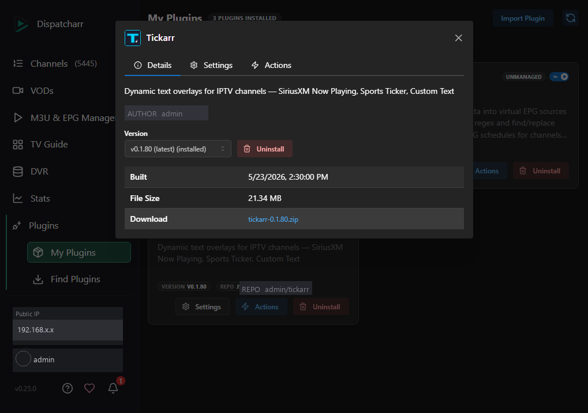
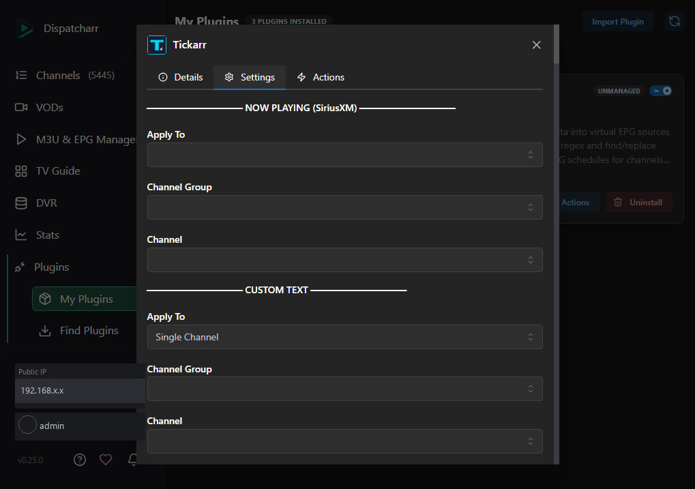
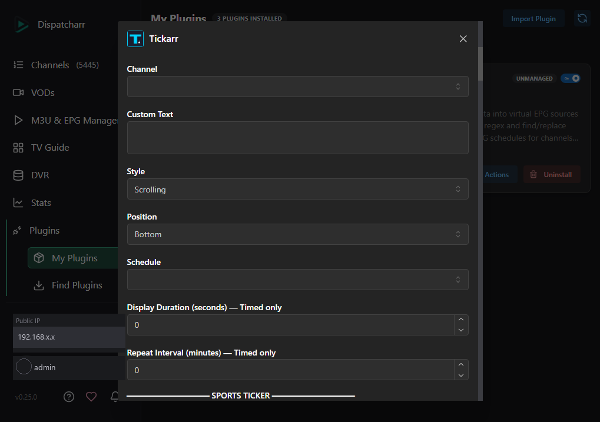
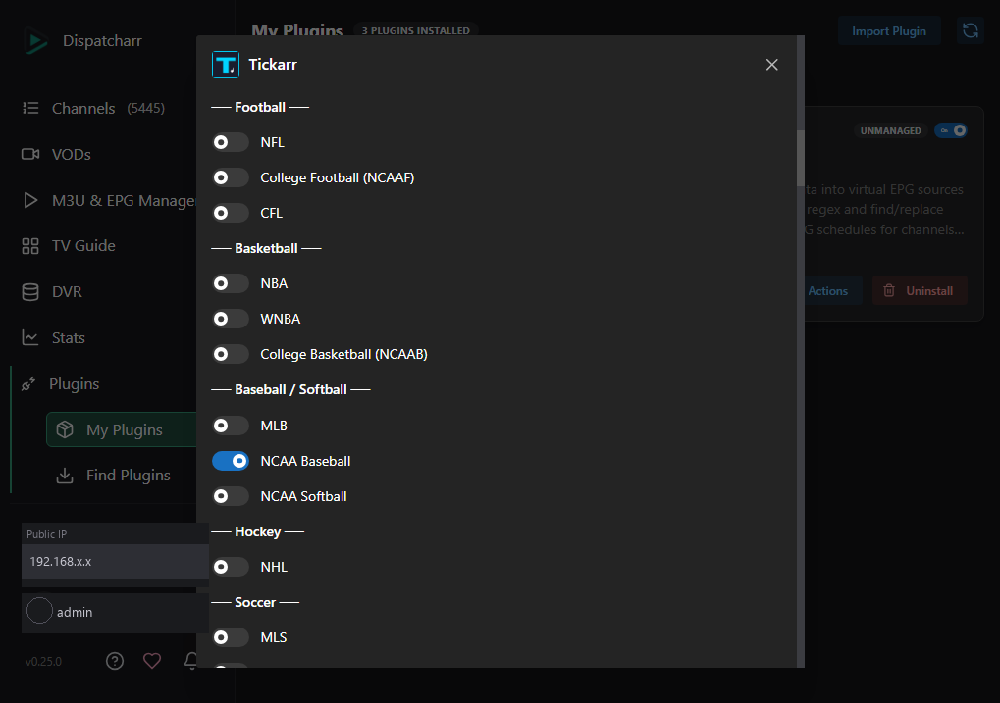
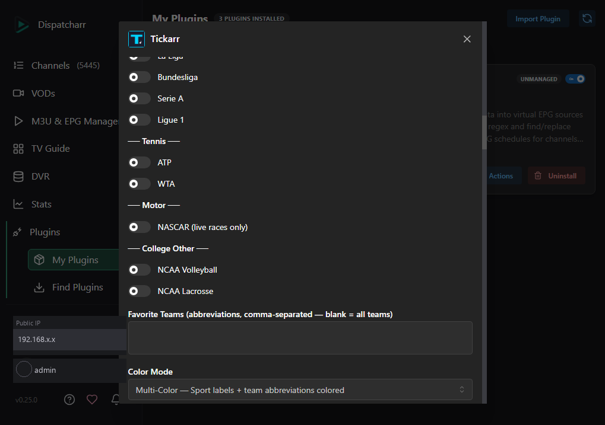
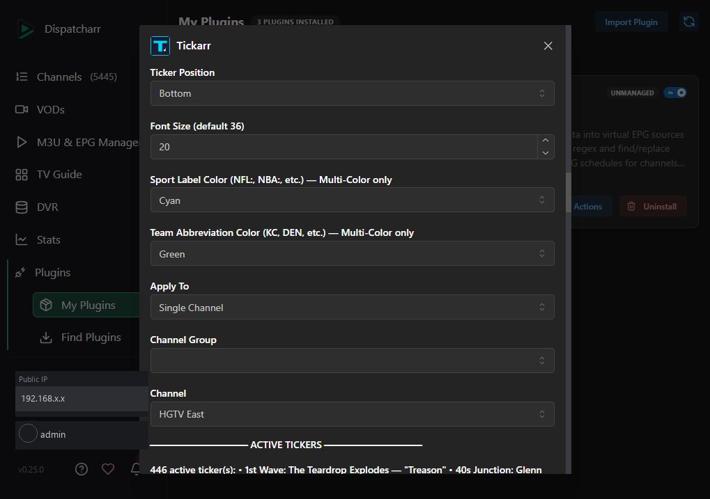
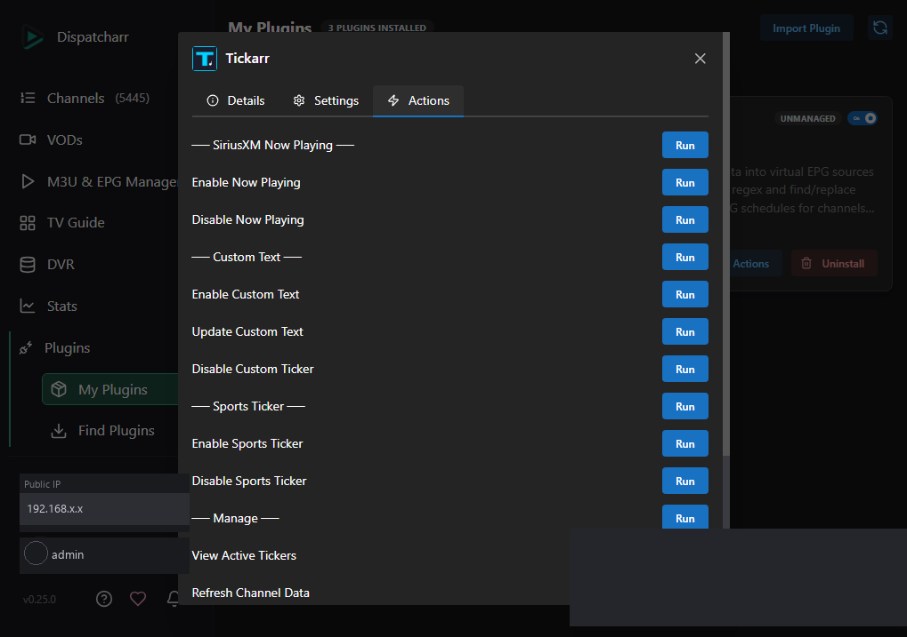
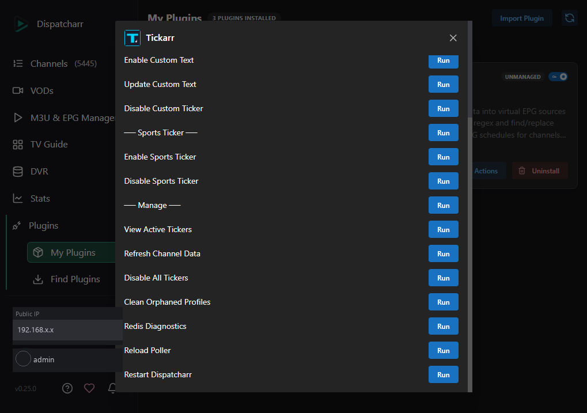

# Tickarr User Guide

Tickarr is a plugin for [Dispatcharr](http://dispatcharr.local) that injects live text overlays into IPTV channels using FFmpeg. For a brief overview, see the [README](../README.md).

---

## Table of Contents

1. [Overview](#overview)
2. [Installation and First Run](#installation-and-first-run)
3. [SiriusXM Now Playing](#sirixusxm-now-playing)
4. [Custom Text](#custom-text)
5. [Sports Ticker](#sports-ticker)
6. [Settings Reference](#settings-reference)
7. [Actions Reference](#actions-reference)
8. [Troubleshooting](#troubleshooting)

---

## Overview

Tickarr adds three types of overlays to channels managed by Dispatcharr:

- **SiriusXM Now Playing** — shows the current artist and track for SiriusXM radio channels.
- **Custom Text** — displays any text you choose, either static or scrolling, on a schedule you control.
- **Sports Ticker** — shows live scores from the ESPN API for 23 leagues and NASCAR.

When you enable an overlay, Tickarr clones the channel's existing FFmpeg stream profile, adds a `drawtext` filter to the cloned copy, and assigns that copy to the channel. Your original stream profile is never changed. When you disable an overlay, the original profile is restored and the cloned profile is deleted.

Text content is written to files on disk (`/data/plugins/tickarr_data/tickers/`). FFmpeg reads those files live, so the overlay updates without interrupting the stream.

---

## Installation and First Run

1. In Dispatcharr, go to **Plugins → Find Plugins**.
2. Paste the Tickarr registry URL into the source field and click **Install**.
3. Wait for the installation to complete.
4. Go to **Tickarr → Actions** and run **Restart Dispatcharr**.

   This step is required. Dispatcharr loads plugin code once at startup; without a restart, none of the new code is active.

5. After Dispatcharr restarts, navigate back to the Tickarr plugin page.
6. Configure your settings for whichever overlay type you want to use, then run the corresponding **Enable** action.

> Note: Repeat steps 3 and 4 after every Tickarr update.

---

## SiriusXM Now Playing

### What it does

Tickarr polls xmplaylist.com at regular intervals to find the currently playing track for each SiriusXM station. It displays the artist name, song title, and the Dispatcharr channel name in a centered overlay box on a black background. For channels that carry audio only (no video signal), Tickarr injects a 1280x720 black video frame so the overlay has somewhere to render.

### Setup

1. Under **Now Playing**, choose who this applies to:
   - **Single Channel** — overlay goes on one channel you select.
   - **Channel Group** — overlay goes on every channel in a group.
   - **All Channels** — overlay goes on every Dispatcharr-managed channel.
2. If you chose Single Channel, select the channel from the **Channel** dropdown. If you chose Channel Group, select the group.
3. Run **Actions → Enable Now Playing**.

### Channel mapping

Tickarr matches Dispatcharr channel names to SiriusXM station names automatically. The match is fuzzy — for example, a channel named "SiriusXM Hits 1" will match the xmplaylist station "Hits 1". You do not need to configure any mapping manually.

> **Note on stream profiles:** Tickarr currently clones a stream profile for every SiriusXM channel in the selected scope. This is a limitation of how Dispatcharr identifies active viewers — the plugin does not yet have access to individual channel IDs at query time. A Dispatcharr feature request is pending to expose per-channel token data, which will allow Tickarr to target only channels with active viewers and eliminate unnecessary profile clones. Until then, enabling Now Playing on a large channel group or "All Channels" will create one cloned profile per SiriusXM channel in that scope.

### What to expect

- The overlay will not appear instantly. The poller needs up to 15 seconds to fetch the first track data after enabling.
- Audio-only channels will show a solid black screen with the overlay centered on it. This is expected behavior.
- The overlay updates automatically as tracks change.

### Disabling

Run **Actions → Disable Now Playing**. The original stream profile is restored and the cloned profile is deleted.

---

## Custom Text

### What it does

Custom Text lets you display any message you choose on one or more channels. You can show it as static text (always the same position, no movement) or as a scrolling ticker. You can keep it on screen at all times or set a timed schedule where it appears for a set number of seconds, disappears, then reappears.

### Setup

1. Under **Custom Text**, choose **Apply To** (Single Channel, Channel Group, or All Channels) and select the channel or group.
2. Enter your message in the **Custom Text** field.
3. Choose a **Style**:
   - **Static** — text stays in a fixed position.
   - **Scrolling** — text scrolls horizontally across the screen.
4. Choose a **Position**: **Top** or **Bottom** of the screen.
5. Choose a **Schedule**:
   - **Always On** — text is visible whenever the channel is being watched.
   - **Timed** — text appears for a specified number of seconds, then hides, then repeats.
6. If you chose Timed, set:
   - **Duration** — how many seconds the text stays visible each cycle.
   - **Interval** — how many seconds between appearances (measured from when the text disappears to when it next appears).
7. Run **Actions → Enable Custom Text**.

### Updating text without disabling

If you want to change the message without disrupting the stream, update the **Custom Text** field and run **Actions → Update Custom Text**. You do not need to disable and re-enable.

### Disabling

Run **Actions → Disable Custom Ticker**.

---

## Sports Ticker

### What it does

The sports ticker pulls live scores from the ESPN API and displays them in a scrolling bar at the top or bottom of the screen. Live games appear first in the rotation, followed by final scores. The ticker updates automatically as scores change.

### Setup

1. Under **Sports Ticker**, choose **Apply To**, then the channel or group.
2. Toggle on the leagues you want to include. Available leagues:

   NFL, NCAAF, CFL, NBA, WNBA, NCAAB, MLB, NCAA Baseball, NCAA Softball, NHL, MLS, NWSL, EPL, UCL, La Liga, Bundesliga, Serie A, Ligue 1, ATP, WTA, NCAA Volleyball, NCAA Lacrosse, NASCAR

3. Optionally, enter team abbreviations in the **Favorite Teams** field (comma-separated, e.g. `LAL, GSW, BOS`). When favorites are set, only games involving those teams are shown. Leave blank to show all teams. See the [ESPN Team Abbreviations Reference](TEAMS.md) for a full list of abbreviations by league.
4. Set **Ticker Position**: Top or Bottom.
5. Adjust **Font Size** if needed (default 36, minimum 16).
6. Choose a **Color Mode**:
   - **Single Color — White** (default, recommended) — all ticker text is white. Uses less CPU and is the smoothest option for most channels.
   - **Multi-Color** — sport/league labels and team abbreviations are rendered in configurable colors. Requires a monospace bold font in the container; falls back to single color if not found.
7. If using Multi-Color, optionally customize:
   - **Label Color** — color for the sport/league label (default gold, `#ffd700`).
   - **Abbrev Color** — color for team abbreviations (default `#00d4ff`).
8. Run **Actions → Enable Sports Ticker**.

> **Note on ticker capacity:** The ticker displays approximately 600 characters of content per pass, with live games shown first. When many leagues are enabled and there are lots of active games, scores that don't fit in the first 600 characters will be shown on the next loop. To make sure the games you care about are always visible, use the **Favorite Teams** field — when favorites are set, only games involving those teams are included, keeping the ticker focused regardless of how many leagues are active.

### "No games scheduled"

If the ticker shows "No games scheduled," it means the ESPN API returned no live or recently finished games for the leagues you selected at the time of the last poll. This is normal during off-hours and off-season. The ticker will update automatically when games begin.

### Disabling

Run **Actions → Disable Sports Ticker**.

---

## Settings Reference

### Now Playing Settings

| Field | Type | Description |
|---|---|---|
| Apply To | Dropdown | Scope of the overlay: Single Channel, Channel Group, or All Channels |
| Channel Group | Dropdown | The channel group to apply the overlay to (visible when Apply To is Channel Group) |
| Channel | Dropdown | The individual channel to apply the overlay to (visible when Apply To is Single Channel) |

### Custom Text Settings

| Field | Type | Description |
|---|---|---|
| Apply To | Dropdown | Scope: Single Channel, Channel Group, or All Channels |
| Channel Group | Dropdown | Channel group selection (visible when Apply To is Channel Group) |
| Channel | Dropdown | Channel selection (visible when Apply To is Single Channel) |
| Custom Text | Text | The message to display on screen |
| Style | Dropdown | Static (fixed position) or Scrolling (horizontal scroll) |
| Position | Dropdown | Top or Bottom of the screen |
| Schedule | Dropdown | Always On or Timed |
| Duration | Number | Seconds the text stays visible per cycle (visible when Schedule is Timed) |
| Interval | Number | Seconds between appearances (visible when Schedule is Timed) |

### Sports Ticker Settings

| Field | Type | Description |
|---|---|---|
| Apply To | Dropdown | Scope: Single Channel, Channel Group, or All Channels |
| Channel Group | Dropdown | Channel group selection (visible when Apply To is Channel Group) |
| Channel | Dropdown | Channel selection (visible when Apply To is Single Channel) |
| League Toggles | Checkboxes | One toggle per supported league/sport; enable the sports you want shown |
| Favorite Teams | Text | Comma-separated team abbreviations; leave blank to show all teams. See the [ESPN Team Abbreviations Reference](TEAMS.md). |
| Ticker Position | Dropdown | Top or Bottom of the screen |
| Font Size | Number | Text size in points (default 36, minimum 16) |
| Color Mode | Dropdown | Single Color — White (default, lower CPU) or Multi-Color (sport labels and team abbreviations in separate colors) |
| Label Color | Color | Color of the sport/league label — Multi-Color only (default gold, #ffd700) |
| Abbrev Color | Color | Color of team abbreviations — Multi-Color only (default #00d4ff) |

---

## Actions Reference

### SiriusXM Now Playing

| Action | Description |
|---|---|
| Enable Now Playing | Clones stream profiles for targeted channels and injects the Now Playing overlay. Starts the xmplaylist poller. |
| Disable Now Playing | Restores original stream profiles on all Now Playing channels and removes the cloned profiles. |

### Custom Text

| Action | Description |
|---|---|
| Enable Custom Text | Clones stream profiles and injects the custom text overlay with the current settings. |
| Update Custom Text | Updates the displayed message on active Custom Text channels without disabling and re-enabling. |
| Disable Custom Ticker | Restores original stream profiles on Custom Text channels and removes the cloned profiles. |

### Sports Ticker

| Action | Description |
|---|---|
| Enable Sports Ticker | Clones stream profiles and injects the sports ticker overlay. Starts the ESPN score poller. |
| Disable Sports Ticker | Restores original stream profiles on Sports Ticker channels and removes the cloned profiles. |

### Manage

| Action | Description |
|---|---|
| View Active Tickers | Lists all channels that currently have a Tickarr overlay active, grouped by overlay type. |
| Refresh Channel Data | Reloads the list of Dispatcharr channels and groups used to populate settings dropdowns. |
| Disable All Tickers | Disables every active Tickarr overlay across all channels and restores original profiles. |
| Clean Orphaned Profiles | Removes cloned stream profiles left behind when a channel was deleted while a Tickarr overlay was still active. |
| Redis Diagnostics | Reports how many channels have active viewers detected via Redis, and whether the Redis connection is healthy. |
| Reload Poller | Restarts background polling threads without restarting Dispatcharr. Use this if overlays stop updating but streams are still running. |
| Restart Dispatcharr | Restarts the Dispatcharr container. Required after every plugin install or update. |

---

## Troubleshooting

### Overlay is not appearing after enabling

1. Confirm you ran **Restart Dispatcharr** after installing or updating the plugin.
2. Check that the channel is actively being watched. Tickarr only applies the overlay to channels with active viewers.
3. Wait up to 15 seconds after enabling for the first data to arrive (especially for Now Playing).
4. If the overlay still does not appear, try **Actions → Reload Poller**, then switch away from and back to the channel in your player.

### Overlay is showing stale or incorrect content

Run **Actions → Reload Poller**. This restarts the background polling threads and forces a fresh data fetch. If the overlay is still stale after a minute, disable and re-enable the channel: the disable/enable cycle re-clones the stream profile with current parameters.

### Audio/video sync problems

**Sports Ticker channels:** The scrolling drawtext filter requires video re-encoding, which can introduce pipeline latency. To compensate, sports ticker channels re-encode audio (`-c:a aac`) so audio PTS is regenerated alongside video rather than passed through independently. If you are still experiencing sync drift, disable and re-enable the channel to ensure the current parameters are applied.

**Now Playing and Custom Text channels:** A/V sync issues can occur if the stream profile was cloned with outdated parameters. Disable and re-enable the affected channel to re-clone the profile with the current FFmpeg settings.

### "No games scheduled" in the sports ticker

This is not an error. It means the ESPN API has no live or finished games to report for the leagues you selected right now. The ticker will begin showing scores automatically when games start. Check your league selections to confirm the right leagues are toggled on.

### Channels appear in the wrong group or are missing from dropdowns

Run **Actions → Refresh Channel Data**. This syncs Tickarr's internal channel list with the current state of Dispatcharr. If a channel is still missing, confirm it is managed by Dispatcharr (not an externally managed or passthrough channel) and that it belongs to a channel group.

### Orphaned stream profiles after deleting channels

If you delete a Dispatcharr channel while a Tickarr overlay is active, the cloned stream profile is left behind. Run **Actions → Clean Orphaned Profiles** to remove them.

### Redis errors or zero active channels in diagnostics

Run **Actions → Redis Diagnostics** to check the connection status. If Redis is unreachable, no channels will be detected as active and Tickarr will not apply overlays. Verify that the Redis service is running inside Dispatcharr and that no network configuration is blocking the connection. Restarting Dispatcharr via **Actions → Restart Dispatcharr** will also restart Redis.

### Plugin changes not taking effect after update

Run **Actions → Restart Dispatcharr**. Dispatcharr caches Python modules at startup; a restart is required for any new or changed plugin code to become active.
